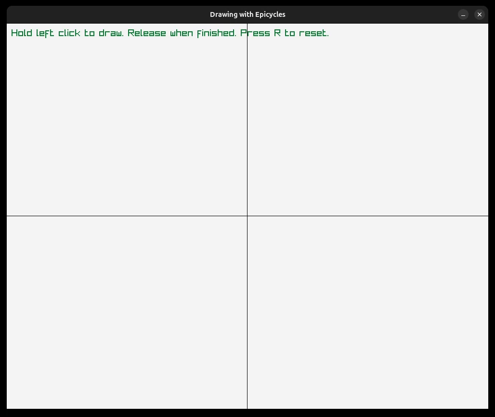

[//]: # (TODO: finish the README.md)

# Epicycle Drawing with Discrete Fourier Transform

This simple C program uses the Discrete Fourier Transform (DFT) to reconstruct a user-drawn path using rotating epicycles.

---

## Project Structure:
```bash
Fourier/
├── inc/
│ ├── complex.h
│ ├── fourier.h
│ └── linked_list.h
├── media/
│ └── demo.gif
├── src/
│ ├── complex.c
│ ├── epicycles.c
│ ├── fourier.c
│ └── linked_list.c
├── makefile
└── README.md
```

---

## How to use the program:
- Draw anything you want holding left click.
- Release when finished. The program will compute the DFT and animate the epicycles.
- Press R to reset the drawing.



---

## Requirements:
- [Raylib](https://www.raylib.com/)
- C compiler (gcc or clang)
- make

---

## How to build the program:
### - Linux/Mac:
```bash
git clone https://github.com/Pablox8/Fourier
cd Fourier
make all
./epicycles
```

#### Note: The default compiler used by the program is gcc, but you can override it using:
```bash
make CC=[other compiler] all
./epicycles
```

### - Windows:
TODO

---

## How does it work:
1. The user drawing is stored as a linked list of points.
2. The points are converted to complex numbers.
3. The DFT is performed with this complex numbers.
4. The frequency, amplitude and phase are extracted from the Fourier coefficients previously computed.
5. This components are used to draw the epicycles and the drawing path.

---

## Sources used:
- Juan Carlos Ponce Campuzano – ["Tracing closed curves with epicycles: A fun application of the Discrete Fourier Transform"](https://www.researchgate.net/publication/367046812_Tracing_closed_curves_with_epicycles_A_fun_application_of_the_Discrete_Fourier_Transform)
- QED Laboratory – ["Epicycle Drawing"](https://www.qedlaboratory.com/post/epicycledrawing/)
- Justin Sciullo – ["Fourier Epicycles Tutorial"](https://justinsciullo.com/posts/GVSU-dft/#defining-epicycles)
- Wikipedia – ["Discrete Fourier Transform"](https://en.wikipedia.org/wiki/Discrete_Fourier_transform)